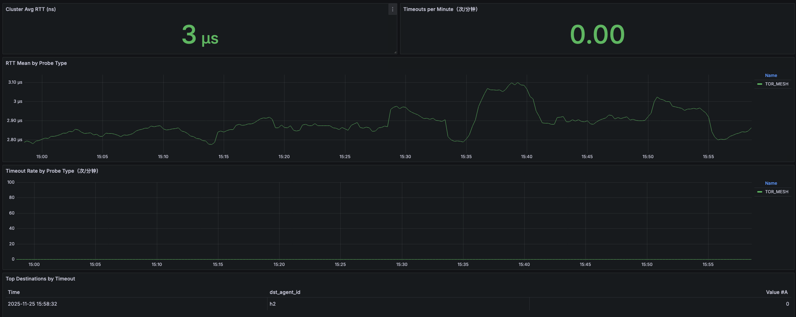
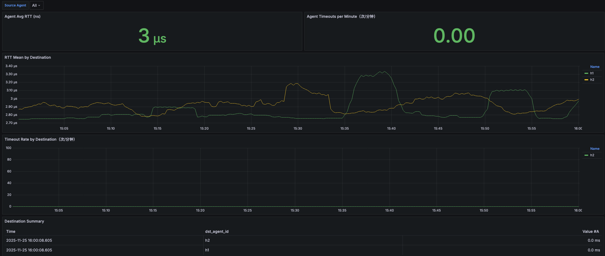

# R-Pingmesh 平台部署指南

## 说明

本仓库在开源项目 `rpingmesh` 的基础上进行了部署适配，目标是在内部算力平台上实现开箱即用的快速部署能力。改造内容包括：

- 统一源代码目录结构，便于构建流程与内部仓库集成；
- 提供补丁脚本，将新增的 `simulator` 组件补充到子模块源码；
- 补充镜像构建与离线分发脚本，满足内部环境对镜像治理的要求；
- 提供一键式端到端部署流程，辅助平台验证与初步体验。

## 预先准备

在执行任何构建与部署前，请确认已完成以下步骤：

1. **拉取子模块源码**

   ```bash
   git submodule update --init --recursive
   ```

2. **应用补丁内容**

   - 同步 Simulator 代码到子模块：

     ```bash
     bash patch/apply_simulator_patch.sh
     ```

   - 覆盖 Analyzer 的入口逻辑，避免重复注册 flag：

     ```bash
     bash patch/apply_analyzer_patch.sh
     ```

   - 同步 Agent 端的 OpenTelemetry 指标实现，确保子模块与补丁版本一致（`otel_metrics.go` 中为了解决同名 Gauge/Histogram 冲突导致的指标注册失败，对原始代码做了修复；）：

     ```bash
     bash patch/apply_agent_telemetry_patch.sh
     ```

   - 应用 Agent 连接恢复补丁，增强 Controller 连接稳定性（添加自动重连机制和连接状态检查，解决长时间运行后连接断开导致 targets 清空的问题）：

     ```bash
     bash patch/apply_agent_controller_client_patch.sh
     bash patch/apply_agent_patch.sh
     ```

   - 应用 RDMA CQ 回补，修复 `ibv_post_recv` 因重复 repost 导致的 slot 被多次重放：

     ```bash
     bash patch/apply_rdma_cq_patch.sh
     ```

   若脚本提示未找到子模块内容，请先确认已完成上一步。

## 构建镜像

1. **全量构建**

   ```bash
   bash build/build_images.sh
   ```

   该脚本会依次构建 Agent、Controller、Analyzer、Simulator 及周边依赖（Prometheus、Grafana、OpenTelemetry Collector、RQLite 等）镜像。

2. **构建单个组件（可选）**

   ```bash
   bash build/build_images.sh agent
   bash build/build_images.sh analyzer
   # 其余组件同理
   ```

3. **离线导出镜像（可选）**

   如果需要在离线环境分发镜像，可执行：

   ```bash
   bash build/save_images.sh /path/to/output all
   ```

   生成的 `*.tar.gz` 文件可在目标环境通过 `docker load` 导入。

## 端到端部署

仓库的 `e2e/` 目录包含客户端与服务端两套部署脚本，支持快速启动一套最小化的验证环境。详细步骤请参考文档：

- [E2E 部署说明](e2e/E2E_Deployment_README.md)

部署前建议先阅读文档中的前置条件（网络、端口、存储路径等），并根据实际环境调整 `.env` 与配置模板。

## 界面预览



